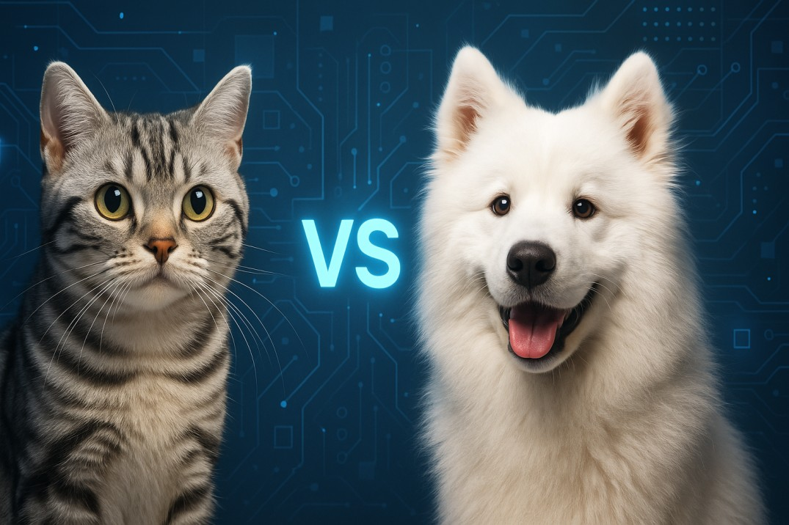
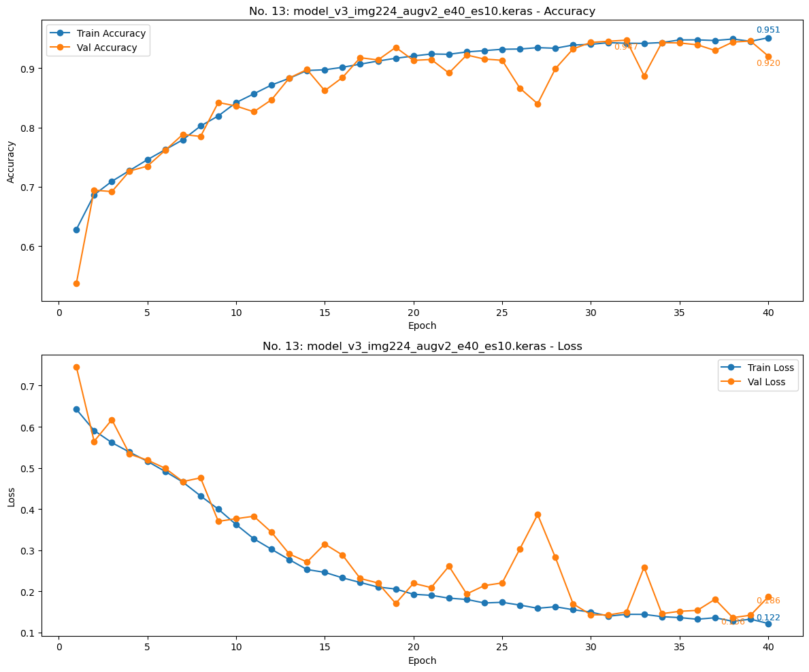
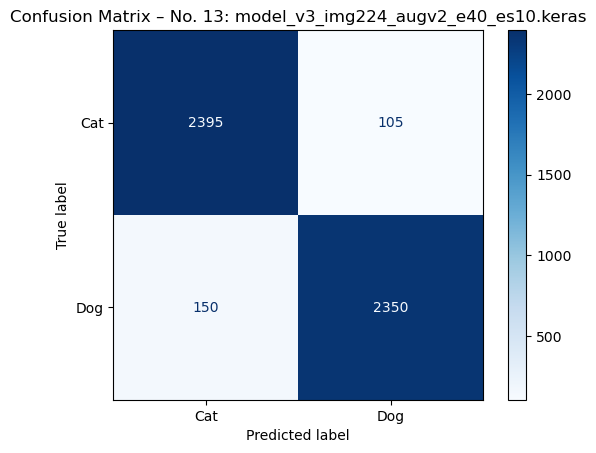
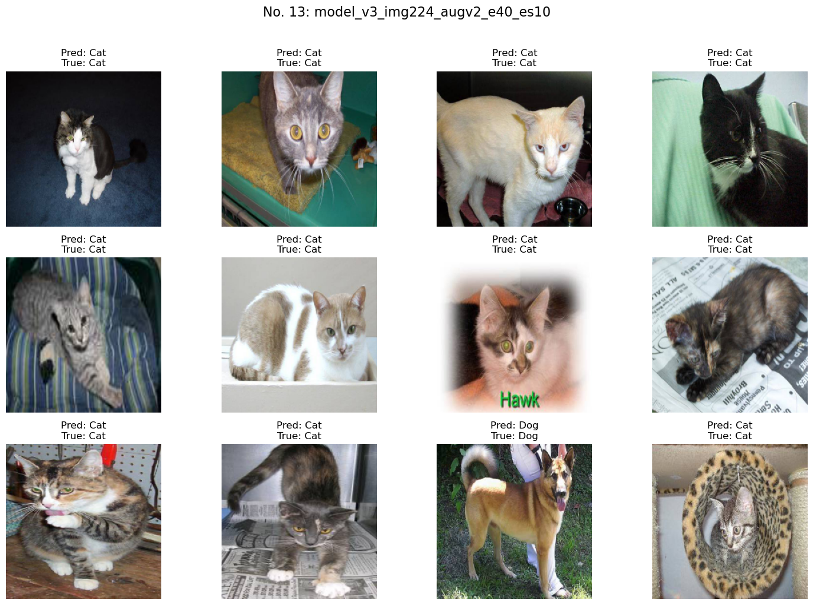

# Cat vs Dog Image Classification – CNN Project Overview

---

## 📑 Table of Contents

- [👤 Author’s Note](#-authors-note)
- [📘 Project Summary](#-project-summary)
- [📂 Dataset](#-dataset)
- [🏆 Best Results](#-best-results)
- [🖼️ Visual Results](#-visual-results)
- [🧠 Model Variants and Numbering](#-model-variants-and-numbering)
- [▶️ How to Run](#️-how-to-run)
- [📄 License](#-license)

---

### 👤 Author’s Note

Hi, I’m **Bo Fu** – an experienced software engineer transitioning into the field of AI. I’ve been accepted into the MSc Artificial Intelligence program at *City, University of London*.

To build a strong foundation before the program starts, I’m actively developing deep learning projects from scratch — combining self-study with hands-on experimentation. This project reflects my personal exploration of Convolutional Neural Networks, from data preparation to model architecture and final evaluation. It is structured for clarity and reproducibility — both for myself and others who might learn from or improve upon it.

🔗 [LinkedIn](https://www.linkedin.com/in/bofu/)  
📅 Completed: June 2025

> This notebook is a work in progress — feedback, suggestions, or pull requests are welcome.

---

### 📘 Project Summary

This notebook builds and evaluates several Convolutional Neural Network (CNN) models to classify cat and dog images. The training pipeline includes:

- Multiple input image resolutions (50×50, 96×96, 160×160, 224×224, 256×256)
- Different data augmentation strategies
- Training with early stopping and history tracking
- Final evaluation on an unseen test dataset
- Also available as a [Kaggle Notebook](https://www.kaggle.com/code/bofu001/catdog-cnn-from-scratch)

---

### 📂 Dataset

- **Source**: The dataset is obtained from the [Kaggle Dogs vs. Cats competition](https://www.kaggle.com/competitions/dogs-vs-cats/data).
- **Original Format**: All images are stored in a single folder and named as `cat.#.jpg` or `dog.#.jpg`.

**Custom Split:**

- **Training + Validation**:
  - 10,000 cat images: `cat.0.jpg` to `cat.9999.jpg`
  - 10,000 dog images: `dog.0.jpg` to `dog.9999.jpg`
  - These were placed in `train_val_ds/cats/` and `train_val_ds/dogs/`

- **Test Set**:
  - 2,500 cat images: `cat.10000.jpg` to `cat.12499.jpg`
  - 2,500 dog images: `dog.10000.jpg` to `dog.12499.jpg`
  - These were placed in `test_ds/cats/` and `test_ds/dogs/`

> 🧾 **Note**: Due to file size limitations and licensing restrictions, the image dataset is not included in this repository. Please download it from Kaggle and organize the images as described above. The folders `train_val_ds/` and `test_ds/` are included as empty placeholders to preserve the project’s directory structure—please populate them with the appropriate images before running the code.

---

### 🧠 Model Variants and Numbering

| Model No.  | Model Name                            | Architecture     | Image Size | Augmentation         | Epochs | Callback         |
|------------|---------------------------------------|------------------|------------|----------------------|--------|------------------|
| No. 1      |   model_v1_img50                      | create_model_v1  | 50×50      | None                 | 10     | None             |
| No. 2      |   model_v1_img96                      | create_model_v1  | 96×96      | None                 | 10     | None             |
| No. 3      |   model_v1_img50_augv1                | create_model_v1  | 50×50      | data_augmentation_v1 | 10     | None             |
| No. 4      |   model_v1_img96_augv1                | create_model_v1  | 96×96      | data_augmentation_v1 | 10     | None             |
| No. 5      |   model_v1_img96_augv1_e20_es3        | create_model_v1  | 96×96      | data_augmentation_v1 | 20     | early_stop_es3   |
| No. 6      |   model_v1_img96_augv2_e20_es3        | create_model_v1  | 96×96      | data_augmentation_v2 | 20     | early_stop_es3   |
| No. 7      |   model_v2_img96_augv1_e20_es3        | create_model_v2  | 96×96      | data_augmentation_v1 | 20     | early_stop_es3   |
| No. 8      |   model_v2_img96_augv2_e20_es3        | create_model_v2  | 96×96      | data_augmentation_v2 | 20     | early_stop_es3   |
| No. 9      |   model_v2_img96_augv1_e25_es8        | create_model_v2  | 96×96      | data_augmentation_v1 | 25     | early_stop_es8   |
| No. 10     |   model_v2_img96_augv2_e25_es8        | create_model_v2  | 96×96      | data_augmentation_v2 | 25     | early_stop_es8   |
| No. 11     |   model_v3_img160_augv1_e30_es8       | create_model_v3  | 160×160    | data_augmentation_v1 | 30     | early_stop_es8   |
| No. 12     |   model_v3_img160_augv2_e30_es8       | create_model_v3  | 160×160    | data_augmentation_v2 | 30     | early_stop_es8   |
| No. 13     |   model_v3_img224_augv2_e40_es10      | create_model_v3  | 224×224    | data_augmentation_v2 | 40     | early_stop_es10  |
| No. 14     |   model_v3_img256_augv2_e45_es12      | create_model_v3  | 256×256    | data_augmentation_v2 | 45     | early_stop_es12  |

> ⚠️ All models are saved using `ModelCheckpoint` to retain the best validation accuracy.

---

### 🏆 Best Results

| Model No.   | Model Name                     | Train Accuracy | Val Accuracy | Precision | F1-Score  |
|-------------|--------------------------------|----------------|--------------|-----------|-----------|
|   No. 13    | model_v3_img224_augv2_e40_es10 | 95.1%          | 92.0%        |   95.7%   |   94.9%   |

---

### 🖼️ Visual Results

**📈 Training History**  
_Model 13 – Accuracy & Loss over 40 epochs_

---

**📊 Confusion Matrix**  
_Model 13 – Evaluated on 5,000 unseen test images_

---

**🐾 Visual Predictions**  
_Model 13 – Predictions on test images (labels shown above each image)_

---

### ▶️ How to Run

1. **Prepare the Datasets**:
   - Place the training set (with `cats/`, `dogs/`) inside the `train_val_ds/` folder  
   - Place the test set (with `cats/`, `dogs/`) inside the `test_ds/` folder

2. **Set Parameters**:
   - Configure the environment at the top of the notebook (`LOCAL` or `KAGGLE`)
   - All paths and hyperparameters (e.g., `SEED`, `BATCH_SIZE`) are defined centrally

3. **Modularized Codebase**:
   - `data_utils.py`: data loading + preprocessing
   - `model_creation.py`: model definitions
   - `train.py`: training pipeline
   - `visualization.py`: plots
   - `evaluation.py`: metrics + visual predictions

4. **Review the Results**:
   - Training curves (accuracy/loss)
   - Confusion matrix with precision and F1-score
   - Visual sample predictions

---

### 📄 License

This project is licensed under the MIT License — see the [LICENSE](LICENSE) file for details.

  

[🔼 Back to Top](#cat-vs-dog-image-classification--cnn-project-overview)